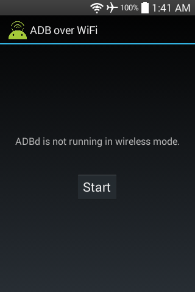
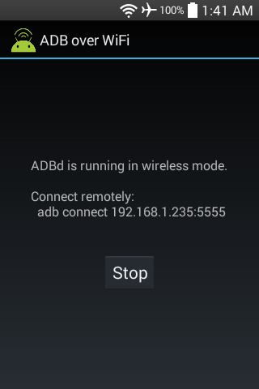

#### [ADB over WiFi](https://github.com/warren-bank/Android-ADB-over-WiFi)

Android app that toggles a __rooted__ device's Android Debug Bridge daemon (adbd) between USB and WiFi mode.

#### Overview:

* this is a tool useful to Android developers

#### Background:

* the _normal_ way to connect an Android device to a computer is over USB:
  * connect Android device to computer by USB cable
  * depending on the computer's OS, make sure drivers are installed
  * test connection:
    ```bash
      adb devices
    ```
* an [_alternative_](https://developer.android.com/studio/command-line/adb#wireless) way to connect an Android device to a computer is over WiFi:
  * connect Android device to computer by USB cable
  * depending on the computer's OS, make sure drivers are installed
  * test connection:
    ```bash
      adb devices
    ```
  * configure Android device over USB to switch its ADB daemon to use wireless mode:
    ```bash
      adb tcpip 5555
    ```
  * reconnect computer to Android device over WiFi:
    ```bash
      adb connect <Android-IP>:5555
    ```
  * detach Android device from USB cable
* an [_alternative_](https://forum.xda-developers.com/showpost.php?p=7663668) way to connect a __rooted__ Android device to a computer over WiFi:
  * configure Android device on its command-line to switch its ADB daemon to use wireless mode:
    ```bash
      su
      setprop service.adb.tcp.port 5555
      stop adbd
      start adbd
    ```
  * connect computer to Android device over WiFi:
    ```bash
      adb connect <Android-IP>:5555
    ```
  * configure Android device on its command-line to switch its ADB daemon back to USB mode:
    ```bash
      su
      setprop service.adb.tcp.port -1
      stop adbd
      start adbd
    ```

#### Screenshots:




#### Notes:

* minimum supported version of Android:
  * Android 1.0 (API 1)

#### Credits:

* [launcher icon](https://github.com/pedrovgs/AndroidWiFiADB/raw/c54f1e8dba380c0d595cf70267f385362f0d4f14/art/AndroidWiFiADBIcon.png)
  * copied from the [AndroidWiFiADB](https://github.com/pedrovgs/AndroidWiFiADB) project repo
  * licensed under [Apache 2.0](https://github.com/pedrovgs/AndroidWiFiADB/blob/c54f1e8dba380c0d595cf70267f385362f0d4f14/LICENSE.txt)
* [Shell.java](https://gist.github.com/ricardojlrufino/61dbc1e9a8120862791e71287b17fef8/raw/adfbf58830886eceb79fb7dd93747f7c07e542b2/Shell.java)
  * authored by [Ricardo JL Rufino](https://github.com/ricardojlrufino)
  * a utility class containing static methods for running commands as root user
    * used as a starting point, but [heavily modified](https://github.com/warren-bank/Android-libraries/tree/ricardojlrufino/Shell)

#### Related Reading:

* "How To" article on XDA: [Execute Root Commands and Read Output](https://forum.xda-developers.com/showthread.php?t=2226664)
  * authored by [pedja1](https://forum.xda-developers.com/member.php?u=4303594)
* "How To" answer on XDA: [enable/disable adb over wifi from the Android command-line with root](https://forum.xda-developers.com/showthread.php?p=7663668#post7663668)
  * authored by [bohlool](https://forum.xda-developers.com/member.php?u=2677911)

#### Legal:

* copyright: [Warren Bank](https://github.com/warren-bank)
* license: [GPL-2.0](https://www.gnu.org/licenses/old-licenses/gpl-2.0.txt)
